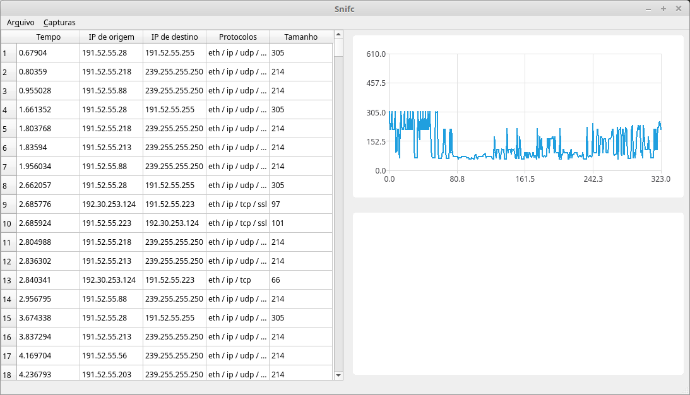

# Snifc

Um sniffer de pacotes com uma interface gráfica, construído usando o
[pyshark](https://github.com/KimiNewt/pyshark) e o
[PyQt5](https://pypi.python.org/pypi/PyQt5).

## Instalação

O programa funciona somente com o Python 3.

Crie um virtualenv.

~~~
virtualenv -p python3 venv
source venv/bin/activate
~~~

Clone o repositório e entre no seu diretório.

~~~
git clone https://github.com/yurihs/snifc.git
cd snifc
~~~

Instale o programa com o pip.

As suas dependências serão instaladas automaticamente.

~~~
pip install .
~~~

## Utilização

Ainda no virtualenv, execute o programa.

A interface gráfica deverá aparecer.

~~~
snifc
~~~

Para iniciar uma captura, utilize o menu "Capturas", selecionando uma interface.

Pacotes aparecerão na lista assim que forem capturados e processados.

